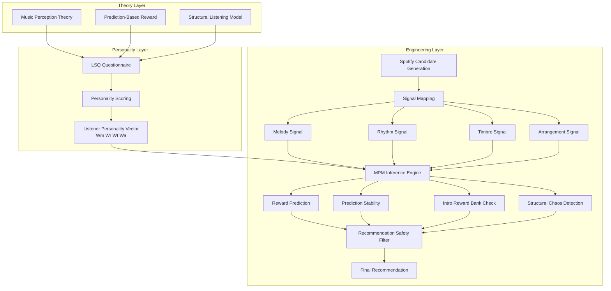

# Music Personality Model (MPM)

MPM is **an independent research prototype** exploring structure-based music recommendation.

Instead of relying primarily on user behavior similarity or genre classification, MPM attempts to model how listeners experience musical structure and predicts reward compatibility between a listener and a piece of music.

The project explores how cognitive mechanisms such as prediction, attention, and reward may influence music preference.

---

# Core Idea

Most modern music recommendation systems rely on:

- collaborative filtering
- behavioral similarity
- large-scale listening history

MPM explores a different direction.

The model assumes that music preference emerges from how listeners perceive and predict musical structure.

When musical patterns are predictable but still stimulating, listeners may experience reward responses.  
MPM attempts to model this interaction between **musical structure** and **listener personality**.

---

## Architecture

MPM is organized into three conceptual layers.

Theory Layer
    Defines the cognitive assumptions behind structure-based music preference.

Personality Layer
    Models listener perception across four musical dimensions:
    melody, rhythm, timbre, and arrangement.

Engineering Layer
    Implements the inference pipeline used to evaluate music tracks and
    predict reward compatibility.

The model evaluates candidate tracks using a discovery pipeline that
integrates external music catalogs (such as Spotify) with the MPM
reward prediction model.

## MPM Architecture

---

# Model Components

MPM currently consists of several conceptual modules.

### Listener Personality

A listener is represented using four perceptual dimensions:

- Melody sensitivity
- Rhythm sensitivity
- Timbre sensitivity
- Arrangement sensitivity

These dimensions form a **music personality profile**.

---

### Structural Signal Analysis

Music is represented through structural signals:

- melody signal
- rhythm signal
- timbre signal
- arrangement signal

These signals approximate how a listener perceives different musical dimensions.

---

### Reward Prediction

The model simulates several mechanisms related to musical reward:

- prediction stability
- reward density
- reward peak intensity
- intro latency
- structural chaos

These factors influence the predicted reward compatibility between a listener and a track.

---

### Recommendation Safety

MPM prioritizes avoiding negative listening experiences.

The system evaluates:

- intro reward viability
- timbre gating effects
- structural instability
- prediction collapse

Tracks that fail safety checks are filtered out before recommendation.

---

# Discovery Pipeline

The recommendation pipeline currently follows this structure:

Spotify candidate generation
↓
signal mapping
↓
MPM inference scoring
↓
recommendation safety filter
↓
final recommendation

This allows the system to integrate external music catalogs (such as Spotify) with the MPM evaluation model.

---

# Demo

An interactive demonstration of the model is available through a GPT-based interface.

The demo allows users to:

- generate a music personality profile
- receive structure-based recommendations
- analyze how MPM evaluates specific songs

Demo access:
[click here](https://chatgpt.com/g/g-69a92c5610788191be675d0135c4c8cd-music-personality-model-mpm-demo)

---

# Project Status

MPM is currently a **research prototype**.

The project focuses on conceptual modeling rather than production deployment.

Some components are simplified due to limited data access and the absence of large-scale listening datasets.

---

# Author

Deng Qing

Background in cognitive psychology and behavioral economics.

MPM was developed as an independent research exploration of how music recommendation might work if listener perception and reward mechanisms were modeled directly.
